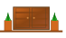

# Furniture Plaza 🛋️

A modern, responsive furniture e-commerce website built with HTML5, CSS3, and vanilla JavaScript. Features a clean design with smooth animations, shopping cart functionality, and a professional user experience.



## 🌟 Features

### Core Functionality
- **Responsive Design** - Optimized for desktop, tablet, and mobile devices
- **Shopping Cart System** - Add to cart, view items, and download invoices
- **Modern Navigation** - Smooth scrolling navigation with mobile hamburger menu
- **Interactive Slideshow** - Hero section with automatic and manual navigation
- **Product Gallery** - Grid layout with hover effects and detailed overlays
- **Team Section** - Meet the team with interactive member profiles
- **Contact Forms** - Easy communication with built-in contact form

### Design Elements
- **Loader Animation** - Professional loading screen with countdown
- **Marquee Collections** - Infinite scrolling product showcase
- **Color Theme** - Warm woodish brown and beige aesthetic
- **Typography** - Poppins and Inter fonts for optimal readability
- **Smooth Animations** - CSS transitions and JavaScript interactions

## 🚀 Live Demo

Open `index.html` in your web browser to view the website locally.

## 📁 Project Structure

```
proj1/
├── index.html              # Main homepage
├── about.html              # About page
├── style.css               # Main stylesheet
├── script.js               # Main JavaScript functionality
├── navigation.js           # Navigation-specific JavaScript
├── README.md               # Project documentation
└── images/                 # Image assets
    ├── furniture-plaza-logo.svg
    ├── furniture-plaza-logo.png
    ├── Slide1.jpg - Slide5.jpg     # Hero slideshow images
    ├── img1.jpg - img5.jpg         # Gallery images
    ├── chair1.jpg - chair4.jpg     # Chair collection
    ├── sofa1.jpg - sofa4.jpg       # Sofa collection
    ├── pchair5.jpg - pchair6.jpg   # Premium chairs
    ├── ashish.jpg                  # Team member photo
    └── Rishi.jpg                   # Team member photo
```

## 🛠️ Technologies Used

- **HTML5** - Semantic markup and modern structure
- **CSS3** - Flexbox, Grid, animations, and responsive design
- **JavaScript (ES6+)** - Dynamic functionality and DOM manipulation
- **Google Fonts** - Poppins and Inter font families

## 🎨 Design System

### Color Palette
- **Primary**: `#8b5a3c` (Woodish Brown)
- **Secondary**: `#8b7355` (Warm Brown)
- **Background**: `#fff8f0` (Cream White)
- **Accent**: `#f5f5dc` (Beige)
- **Text**: `#333` (Dark Gray)

### Typography
- **Headers**: Poppins (300, 500, 700)
- **Body**: Inter (400, 600, 700)
- **Navigation**: Poppins Medium

## 📱 Responsive Breakpoints

- **Desktop**: 1200px and above
- **Tablet**: 768px - 1199px
- **Mobile**: 320px - 767px

## 🚀 Quick Start

1. **Clone or Download** the project files
2. **Open** `index.html` in your web browser
3. **Explore** the different sections and features
4. **Customize** content, images, and styling as needed

## 📄 Pages

### Homepage (`index.html`)
- Hero slideshow with 5 premium furniture images
- Navigation bar with smooth scrolling
- Image gallery with interactive overlays
- Products section with shopping cart
- About section with company information
- Team section with member profiles
- Collections marquee with infinite scroll
- Contact form and footer

### About Page (`about.html`)
- Company story and mission
- Team member profiles
- Core values and features
- Call-to-action sections

## 🛒 Shopping Cart Features

- Add products to cart
- View cart items and quantities
- Calculate total prices
- Download invoice functionality
- Persistent cart count display

## 👥 Team Members

- **Ashish Choudhary** - CEO & Founder
- **Saptarshi Mahim** - COO & Co-Founder

## 🎯 Key Sections

1. **Hero Section** - Slideshow with navigation dots
2. **Image Gallery** - Interactive grid with overlays
3. **Products** - E-commerce functionality
4. **About** - Company information
5. **Team** - Member profiles
6. **Collections** - Marquee showcase
7. **Contact** - Contact form and information
8. **Footer** - Links and social media

## 🔧 Customization

### Adding New Products
Edit the `products` array in `script.js`:
```javascript
const products = [
    {
        id: 1,
        name: "Product Name",
        price: 299.99,
        image: "images/product.jpg",
        description: "Product description"
    }
];
```

### Changing Colors
Update CSS variables in `style.css`:
```css
:root {
    --primary-color: #8b5a3c;
    --secondary-color: #8b7355;
    --background-color: #fff8f0;
}
```

### Adding New Images
1. Add images to the `images/` folder
2. Update image paths in HTML
3. Ensure images are optimized for web

## 📈 Performance Features

- **Optimized Images** - Compressed for fast loading
- **Minified Code** - Clean, efficient CSS and JavaScript
- **Responsive Images** - Adaptive sizing for different devices
- **Smooth Animations** - Hardware-accelerated CSS transitions

## 🔍 SEO Features

- Semantic HTML5 structure
- Alt tags for all images
- Meta descriptions and titles
- Proper heading hierarchy
- Clean URL structure

## 🌐 Browser Support

- Chrome 60+
- Firefox 55+
- Safari 11+
- Edge 79+

## 📝 License

This project is open source and available under the [MIT License](LICENSE).

## 🤝 Contributing

1. Fork the project
2. Create your feature branch (`git checkout -b feature/AmazingFeature`)
3. Commit your changes (`git commit -m 'Add some AmazingFeature'`)
4. Push to the branch (`git push origin feature/AmazingFeature`)
5. Open a Pull Request

## 📧 Contact

- **Email**: ashishjac4495@gmail.com
- **Phone**: +91 9136300136

## 🙏 Acknowledgments

- Google Fonts for typography
- Modern CSS techniques for responsive design
- JavaScript ES6+ features for enhanced functionality

---

**Furniture Plaza** - Transform your space with premium furniture collections. Quality, style, and comfort in every piece.
